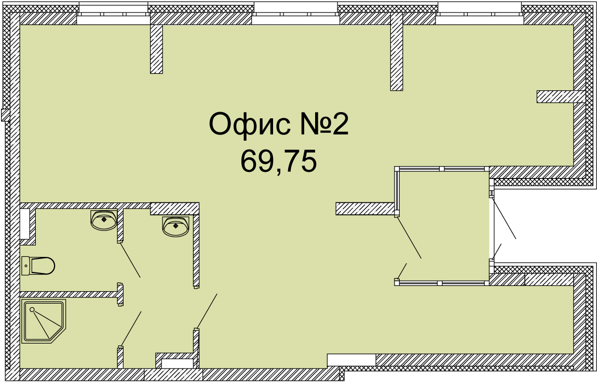

# Welcome new developer

Данный раздел должен помогать новому сотруднику на протяжении всего периода онбординга.

## Чем плох наш Cfl?

Наш Cfl - это здоровенная, не структурированная помойка из информации.

Как правило весь первый рабочий день уходит на чтение cfl. Это долго, это скучно, это бесполезно и нахер не упало разработчику.

Сервис `Welcome new developer` содержит всю необходимую на первых порах информацию для сотрудника.

***

## Содержание

***

## Карта офиса

Штука простая, но нужная.

Карта должна быть схематичной и простой: на карте отмечены кухня, туалет, переговорки и т.д.

*Отметить ключевые точки*

***

### Кратко о компании

- История
- Ценности
- Руководство
  
*Для любознательных ссылка на раздел Cfl*

***

### К кому идти если есть вопросы?

Список лиц, которые занимаются конкретными вопросами

*Новичок не дергает тимлида и коллег, а сразу идет по адресу*

***

## Чаты в Telegram

Список с чатами и их назначением.

***

### База сотрудников

Народу море, запоминать всех тяжело.

Два варианта решения проблемы:

**Утопичный**

Все сотрудники в телеге ставят свои фотографии, пишут реальные имена и фамилии. В чатах постоянно все это мелькает и запоминается очень быстро (Я таких в первую очередь и запомнил).

**Реалистичный вариант**

Создать базу сотрудников с фотографиями и @telegram.

Поможет не только новичку запомнить всех остальных, но и всем остальным запомнить новичка (очень актуально если их несколько сразу).

*** 

## Офисный мероприятия

Информация о происходящий внутренних мероприятиях:

- Доклады;
- Пиво по пятница;
- Трансляции;

***

## Зарплате, премия, отпуск, больничный?

***

## Доступы к сервисам и правила их использования

- Browserstack
- ...

***

## Отдельно о настройке почты и почтового клиента

***

## Что дальше?

После ознакомления с разделом Welcome new developer, разработчик уже представляет как работает компания.

Дальше человеку нужно понять как ему писать код.

Этой цели служит раздел [QuickStart](../quick_start/idea.md)

К нему стоит приступать со второго дня, чтоб не сильно напрягаться в первый рабочий день.

Вместо этого с новичком стоит попить кофе, поиграть в PlayStation. Вообще идеально, если первый день выпал на пятницу, это хороший шанс быстрее влиться в коллектив и уйти на выходные с положительными эмоциями.